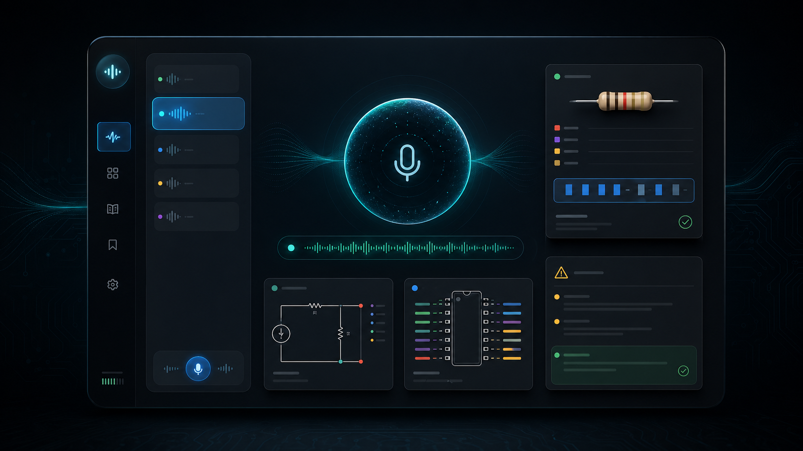

# Clitronic

Your voice-first electronics companion. Ask about circuits, components, microcontrollers, and maker hardware, then get live captions, spoken responses, and instant visual cards.



## What It Does

Clitronic turns natural language questions into rich, animated UI cards. It is not a chatbot UI with a transcript dump. It is a dynamic UI engine for electronics with realtime voice layered on top.

```text
Mic input → Realtime transcription → Structured JSON → UI Renderer → Animated Components
```

Ask "What resistor for a red LED on 5V?" and get a calculation card with the formula, inputs, and result. Ask "Compare Arduino Uno vs Raspberry Pi Pico" and get a side-by-side comparison. Ask "Show me what a breadboard looks like" and get a real photo with attribution.

## Latest Update

- Realtime voice remains the primary interaction path, with text input available from the welcome screen and during active sessions.
- The mute control now mutes the user's microphone track, not assistant playback.
- Recent turns can reopen previous structured visual answers without another model call.
- Follow-up chips suggest useful next actions based on the rendered card type.
- Safety notes are surfaced consistently across electronics cards without weakening schema validation.
- Visual cards now share consistent headers, count badges, copy actions, and progressive disclosure for long wiring/troubleshooting lists.
- Image follow-ups like "show me one" resolve from recent context instead of collapsing into generic searches.

### 10 Visual Components

| Component                | Use Case                                |
| ------------------------ | --------------------------------------- |
| **Spec Card**            | Specs and features of a component       |
| **Comparison Card**      | Side-by-side qualitative comparison     |
| **Explanation Card**     | How something works, key concepts       |
| **Image Block**          | Real product photos or circuit diagrams |
| **Recommendation Card**  | What to buy or use                      |
| **Troubleshooting Card** | Debug steps for broken circuits         |
| **Calculation Card**     | Formulas with inputs and results        |
| **Pinout Card**          | IC pin layouts with color-coded types   |
| **Chart Card**           | Numeric comparisons as bar charts       |
| **Wiring Card**          | Step-by-step wiring instructions        |

## Stack

- **Frontend**: Next.js 16 (App Router) + React 19 + Tailwind CSS 4
- **Structured UI generation**: OpenAI `gpt-4o-mini` with structured JSON output
- **Realtime voice**: OpenAI Realtime API + `gpt-4o-mini-transcribe`
- **Image Search**: Brave Search API + Wikimedia Commons fallback
- **Design**: Dark-only, Apple/Tesla-inspired, animation-first

No database. No auth. No persistence. Fast and stateless.

## Getting Started

```bash
git clone https://github.com/sergiopesch/clitronic.git
cd clitronic
nvm use
npm install
```

Node `20.x` is the supported runtime for both the web app and the CLI. The repo includes `.nvmrc` and `engines.node`, so `nvm use` keeps local development aligned with CI.

Create `.env.local` from `.env.example`:

```bash
cp .env.example .env.local
OPENAI_API_KEY=your_key_here
BRAVE_API_KEY=your_key_here  # optional, upgrades image search
```

```bash
npm run dev
```

Open [http://localhost:3000](http://localhost:3000).

## Local Voice Test

1. Start the app with `npm run dev`.
2. Open `http://localhost:3000` in a Chromium-based browser or Safari.
3. Allow microphone access when prompted.
4. Press the talk button and say something like `show me an Arduino image`.
5. Expected behavior:
   - your words appear while you are speaking
   - the assistant starts speaking back with a live on-screen word-by-word caption
   - the matching visual card appears underneath

Good smoke tests:

- `show me an Arduino image`
- `tell me about the ESP32` then `show me one`
- `compare Arduino Uno vs Raspberry Pi Pico`
- `my LED is not blinking`

## Commands

```bash
npm run dev          # Dev server
npm run build        # Production build
npm run validate     # Type check + lint + format check
npm test             # Runtime schema/normalization tests
npm run scaffold:component -- --name "Signal Meter" --kind chart
```

Security disclosures: see [SECURITY.md](SECURITY.md).

## Provider Split

The web app and CLI intentionally use different providers today.

- **Web app**: OpenAI for structured UI generation, realtime voice, and transcription
- **CLI**: Anthropic for terminal chat and image-identify flows

That split is deliberate rather than accidental:

- the web app depends on OpenAI Realtime plus the JSON-card response contract
- the CLI is optimized for streaming terminal responses and local image inspection

If you want to use the CLI as well:

```bash
cd cli
nvm use
npm install
export ANTHROPIC_API_KEY=your_key_here
npm run start -- --help
```

## Architecture

```text
app/
├── api/chat/route.ts           # LLM endpoint orchestration
├── api/chat/response-normalizer.ts # Shape rescue + component normalization
├── api/chat/response-validator.ts  # Strict runtime response validation (zod)
├── api/chat/security.ts        # Input sanitization + injection detection
├── api/chat/rate-limit.ts      # In-memory per-IP limiter with cleanup
├── api/image-search/route.ts   # Thin HTTP wrapper over image-search service
├── api/image-proxy/route.ts    # Safe image proxy for remote image tiles
├── api/realtime/session/route.ts # OpenAI Realtime session bootstrap
├── globals.css                 # Design tokens + keyframe animations
└── page.tsx                    # Entry point
components/
├── console/local-console.tsx   # Client entry wrapper
├── console/conversation-shell.tsx # Voice-first shell and card stage
├── voice/voice-transcript-strip.tsx # Live user/assistant captions
└── ui/                         # 10 visual card components + renderer
    ├── ui-renderer.tsx         # Routes JSON → component via registry map
    ├── animations.tsx          # AnimateIn wrapper
    ├── card-layout.tsx         # Shared card headers, count badges, disclosure controls
    ├── copy-button.tsx         # Clipboard actions for formulas/results/steps
    ├── safety-callout.tsx      # Consistent safety note presentation
    ├── spec-card.tsx
    ├── comparison-card.tsx
    ├── explanation-card.tsx
    ├── image-block.tsx         # Dual-mode: SVG diagrams + web photos
    ├── recommendation-card.tsx
    ├── troubleshooting-card.tsx
    ├── calculation-card.tsx
    ├── pinout-card.tsx         # SVG IC pin layout
    ├── chart-card.tsx          # Horizontal bar chart
    ├── wiring-card.tsx         # Step-by-step wiring guide
    └── text-response.tsx       # Word-by-word spoken-text fallback
hooks/
├── useConversationState.ts     # Structured response fetch + history context
├── usePrefersReducedMotion.ts  # Motion preference hook for accessible animation
└── useVoiceInteraction.ts      # Realtime voice, transcripts, audio, turn handling
lib/
├── ai/component-registry.ts    # Single source of truth for component names/aliases/types
├── ai/openai-config.ts         # Shared OpenAI model + realtime config
├── ai/response-schema.ts       # TypeScript response contracts
├── ai/rate-limit.ts            # Shared rate-limit constants/messages
├── ai/system-prompt.ts         # Intent detection + response formatting
└── ai/transcript-utils.ts      # Light cleanup for speech transcripts
```

## UI And UX Notes

The current app experience is optimized around a voice-first workshop workflow:

- the welcome screen supports either push-to-talk or typed prompts
- the bottom control band keeps text input, voice capture, and mic mute in one predictable place
- active voice states use explicit cancel/stop behavior instead of separate competing controls
- response cards use shared headers via `components/ui/card-layout.tsx`
- long wiring and troubleshooting cards show the first five steps/checks, then allow expansion
- safety callouts remain visible above collapsed content
- calculation and wiring cards include copy actions for formulas, results, and steps

See [docs/ui-ux-polish.md](./docs/ui-ux-polish.md) for the interaction patterns and design constraints behind the current card system.

## How It Works

1. **Realtime voice capture**: the client opens an OpenAI Realtime session and streams mic audio.
2. **Live captions**: partial transcripts update the UI while the user is still speaking.
3. **Turn finalization**: once the transcript is finalized, the cleaned utterance is sent to `/api/chat`.
4. **Structured response generation**: the chat route normalizes and validates the model output, with fast-path handling for explicit photo requests.
5. **Client rendering**: `UIRenderer` routes the validated payload to the correct animated card, or falls back to a visible word-by-word text response.
6. **Context-aware visuals**: compact assistant summaries preserve image/component context so follow-ups like `show me one` still resolve correctly.

### Adding or Updating Components

Use this order to avoid drift:

1. Update `lib/ai/component-registry.ts` (name, alias, type, detection signature)
2. Update `lib/ai/response-schema.ts` data contract
3. Update `app/api/chat/response-validator.ts` component data schema
4. Update `components/ui/ui-renderer.tsx` renderer mapping
5. Update `lib/ai/system-prompt.ts` component guidance

#### Scaffolding Helper

Use the scaffolding script to generate a new UI component file and a guided integration checklist:

```bash
npm run scaffold:component -- --name "Signal Meter" --kind chart
```

- `--name` supports spaces, kebab-case, snake_case, or PascalCase.
- `--kind` must be one of: `card`, `chart`, `image`.
- The script creates `components/ui/<name>-card.tsx` and prints the exact follow-up edits required across registry/schema/validator/renderer/prompt.

## Environment Variables

| Variable           | Required | Description                                  |
| ------------------ | -------- | -------------------------------------------- |
| `OPENAI_API_KEY`   | Yes      | OpenAI API key                               |
| `BRAVE_API_KEY`    | No       | Brave Search API key (upgrades image search) |
| `DAILY_RATE_LIMIT` | No       | Daily requests per IP (default: 20)          |

## Roadmap

See [ROADMAP.md](./ROADMAP.md) for upcoming work beyond the shipped realtime voice flow, including richer multi-card responses and circuit simulation.

## License

MIT
