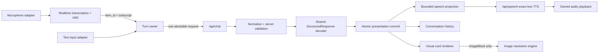
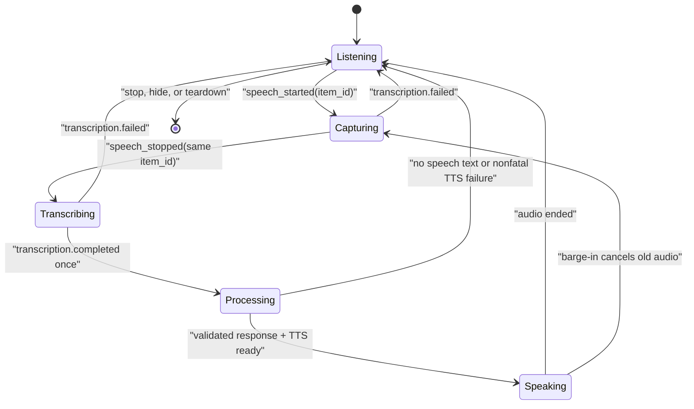

# Interaction Engine Architecture

Clitronic has one semantic answer engine. Realtime audio, structured generation, visual rendering,
history, and speech are adapters around that answer; none may independently invent or commit a
second answer.

## Non-negotiable invariants

1. **One answer per turn.** Realtime sessions are `type: "transcription"`; VAD has
   `create_response: false` and `interrupt_response: false`. `/api/chat` is the only semantic answer
   generator.
2. **Validate before ownership.** Successful HTTP JSON is `unknown` until the shared Zod decoder
   accepts it. Intent, rate-limit accounting, UI state, history, and speech cannot inspect or commit
   an unchecked payload.
3. **Every asynchronous result has an owner.** Voice turns use the provider's `item_id`; startup,
   chat, speech fetch, and playback each use abortable ownership. Late, stale, or duplicate events
   are ignored.
4. **Speech is a projection, not another answer.** The exact bounded string derived from the
   validated response is sent to fixed server-side TTS. No second conversational model paraphrases
   the card.
5. **Barge-in is atomic cancellation.** A new speech-start event cancels the old canonical request
   and local speech before the new item can capture state.
6. **Mute has one owner.** Microphone mute is input-only: it discards an open input turn but does not
   cancel an already-processing canonical answer or its speech. Stop, page hiding, transport failure,
   and unmount close the mic, data channel, peer connection, audio, object URLs, and timers. One
   cleanup failure cannot prevent the remaining cleanup.
7. **Visual cards remain structured.** The visual-card registry and JSON architecture are preserved;
   invalid components or data shapes never reach a renderer.
8. **Image state is explicit.** Remote image wire payloads decode to `ready`, `possible`, or `empty`.
   The renderer adds an `unavailable` presentation state for request, parsing, or provider failure.
   Only confident, proxy-compatible results are publicly cached; a provider outage is never
   presented as a valid no-match.

## Turn lifecycle

The UI label remains a derived view of this lifecycle. The source of truth is ownership: an event may
change state only when its `item_id` is current and has not already completed.

## Boundary behavior

| Boundary         | Accepted input                                                   | Rejection behavior                                                            |
| ---------------- | ---------------------------------------------------------------- | ----------------------------------------------------------------------------- |
| Realtime session | Same-origin request, rate budget, valid server key               | Non-cacheable safe error; no key or upstream detail reflection                |
| Realtime event   | Current `item_id`, canonical event type                          | Ignore stale/duplicate events; transcription failure returns to listening     |
| Chat response    | Shared `StructuredResponse` contract                             | No usage, UI, history, or speech mutation                                     |
| Speech route     | Same-origin strict `{ "text": string }`, ≤600 characters, ≤4 KiB | No truncation; safe non-cacheable JSON error                                  |
| Speech playback  | Current turn, current fetch owner, non-empty audio               | Preserve the card; cancel or report speech as a nonfatal presentation failure |
| Image resolution | Parsed wire contract, HTTPS proxy-compatible candidates          | Keep the card shell and expose an honest possible/no-match/unavailable state  |

## Visual resolution engine

Image resolution is a separate presentation adapter. Component lookups use focused curated
profiles; multi-object environments use compound scene profiles so an electronics bench cannot
collapse into one jumper-wire result. Provider responses are untrusted until their envelope,
candidate bounds, URL policy, metadata, confidence invariant, and final wire payload all validate.

The renderer loads a thumbnail first, promotes reserve candidates when a source fails, retains a
proven thumbnail when a full-resolution upgrade fails, and carries failed URLs into an explicit
retry. The proxy independently enforces HTTPS host policy, public DNS resolution, byte limits,
declared media type, and raster file signatures. Low-confidence and empty results are never stored
in the long-lived service cache.

## Safety ownership

Safety remains part of the canonical structured response. TTS extracts deterministic safety facts
from every card type that can receive server-side safety augmentation, so an existing warning is not
silently omitted. The speech projection never invents new electrical instructions. Mains electrical,
structural, battery, fire, and code-compliance work remains planning guidance with
licensed-professional advice where appropriate.

## Verification gates

- Pure contract tests cover malformed successful JSON, forged intent, every visual-card speech
  projection, length bounds, and warning retention.
- Turn tests cover stale items, duplicate completion, replacement, invalidation, and data-channel send
  races.
- Route tests cover origin enforcement, body limits, rate limits, credential rotation, redacted errors,
  timeouts, cancellation, exact upstream TTS parameters, and response headers.
- Image tests cover scene-vs-component routing, provider outage semantics, URL-policy parity, cache
  isolation, malformed siblings, retry exclusions, reserve promotion, and thumbnail restoration.
- The full repository gate is `npm run validate`, `npm test`, and `npm run build`.
- Every answer-shaping optimization additionally runs the 41-case AutoResearch quality experiment.
- Release verification includes a real transcription client-secret check, a real short TTS check, and
  rendered browser inspection. Microphone permission remains a user-controlled browser action.
